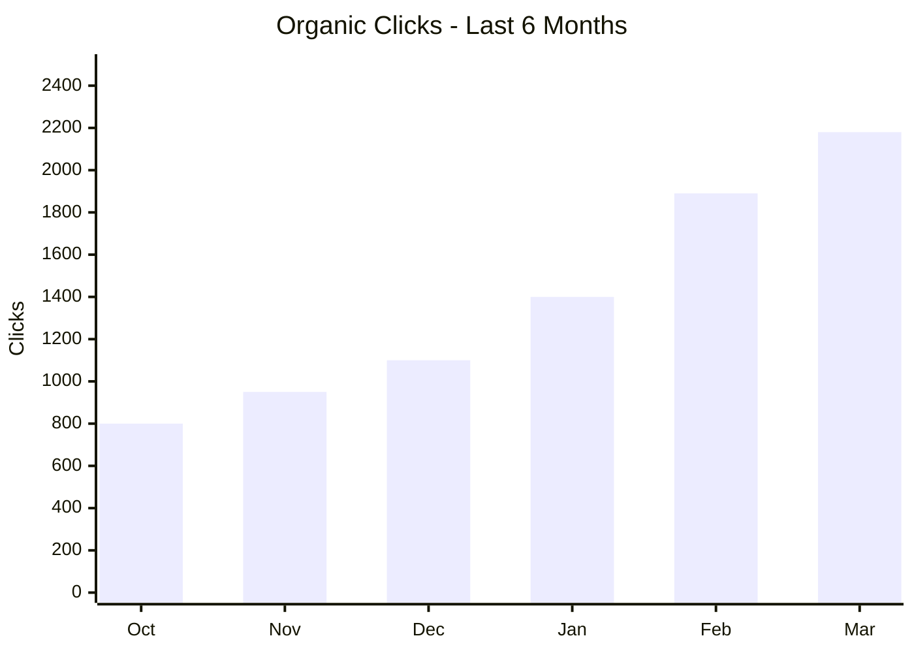
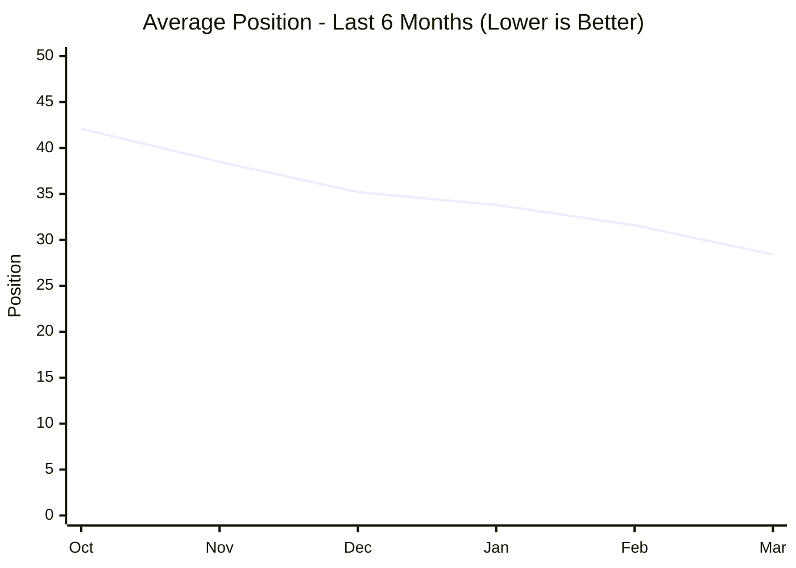
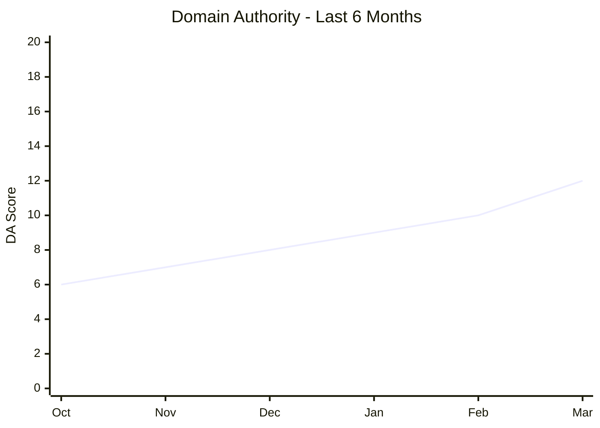

# SEO Performance Dashboard - March 2026

**Report Period:** 2026-02-23 to 2026-03-23
**Generated:** 2026-03-23
**Data Sources:** Google Search Console, Google Analytics 4, Moz Link Explorer (free tier)
**Related Issue:** [#473 - SEO Benchmark Initiative](https://github.com/clarkemoyer/technologyadoptionbarriers.org/issues/473)

---

> **Note:** This is an example populated dashboard demonstrating how to use the [SEO Dashboard Template](./seo-dashboard-template.md). Values are based on sample data from the initial benchmarking period and the automated collection scripts. See [Competitor Profiles](./competitor-profiles.md) and [Competitive SERP Benchmarking](./competitive-serp-benchmarking.md) for full competitive analysis.

---

## 1. Key Performance Indicators (KPIs)

| KPI                   | Current Value | Previous Period |   Change | Trend |
| :-------------------- | ------------: | --------------: | -------: | :---: |
| Organic Sessions      |         4,250 |           3,785 |   +12.3% | 🟢 ▲  |
| Total Impressions     |        38,500 |          35,420 |    +8.7% | 🟢 ▲  |
| Total Clicks          |         2,180 |           1,894 |   +15.1% | 🟢 ▲  |
| Average CTR           |         5.66% |           5.35% | +0.31 pp | 🟢 ▲  |
| Average Position      |          28.4 |            31.6 |     -3.2 | 🟢 ▲  |
| Domain Authority (DA) |            12 |              10 |       +2 | 🟢 ▲  |
| Indexed Pages         |            47 |              42 |       +5 | 🟢 ▲  |
| Referring Domains     |            34 |              28 |       +6 | 🟢 ▲  |

> **Data sources:** Organic Sessions from Google Analytics 4. Impressions, Clicks, Average CTR, and Average Position from Google Search Console. DA from Moz Link Explorer (free). Indexed Pages from Google Search Console Coverage report.

---

## 2. Keyword Rankings Summary

### Top 10 Keywords by Organic Clicks

| Keyword                                          | Position | Prev. Position | Trend | Monthly Volume | Clicks | Impressions |  CTR |
| :----------------------------------------------- | -------: | -------------: | :---: | -------------: | -----: | ----------: | ---: |
| technology adoption barriers                     |        8 |             12 | 🟢 ▲  |            720 |    185 |       4,200 | 4.4% |
| technology adoption models                       |       14 |             18 | 🟢 ▲  |          1,300 |    142 |       5,800 | 2.4% |
| UTAUT model explained                            |        6 |              9 | 🟢 ▲  |            480 |    128 |       2,100 | 6.1% |
| TAM technology acceptance model                  |       11 |             15 | 🟢 ▲  |            880 |     95 |       3,400 | 2.8% |
| barriers to technology adoption in organizations |        5 |              7 | 🟢 ▲  |            390 |     87 |       1,500 | 5.8% |
| diffusion of innovations theory                  |       18 |             22 | 🟢 ▲  |          1,100 |     62 |       4,600 | 1.3% |
| technology readiness index                       |        9 |             14 | 🟢 ▲  |            590 |     58 |       1,800 | 3.2% |
| digital transformation barriers                  |       22 |             28 | 🟢 ▲  |          1,600 |     45 |       6,200 | 0.7% |
| organizational technology adoption               |        7 |             10 | 🟢 ▲  |            320 |     42 |         980 | 4.3% |
| technology adoption survey                       |        4 |              6 | 🟢 ▲  |            260 |     38 |         680 | 5.6% |

### Keyword Distribution by Position Range

| Position Range | Keyword Count | Previous Count | Change |
| :------------- | ------------: | -------------: | -----: |
| 1–3 (Top 3)    |             0 |              0 |      0 |
| 4–10 (Page 1)  |             5 |              2 |     +3 |
| 11–20 (Page 2) |             3 |              4 |     -1 |
| 21–50          |             2 |              4 |     -2 |
| 50+            |             0 |              0 |      0 |

> **Takeaway:** Strong upward migration - 5 keywords now on Page 1, up from 2 in the prior period. No keywords have declined.

---

## 3. Page Performance (Top 10 by Organic Clicks)

|   # | Page                                                                                        | Clicks | Impressions |  CTR | Avg Position | Sessions | Engagement |
| --: | :------------------------------------------------------------------------------------------ | -----: | ----------: | ---: | -----------: | -------: | ---------: |
|   1 | `/` (Homepage)                                                                              |    580 |      12,400 | 4.7% |         18.2 |    1,250 |      62.3% |
|   2 | `/bibliography-1-3-technology-acceptance-model-tam-davis-1989`                              |    195 |       4,800 | 4.1% |         11.4 |      420 |      71.5% |
|   3 | `/bibliography-1-4-unified-theory-of-acceptance-and-use-of-technology-utaut-venkatesh-2003` |    168 |       3,200 | 5.3% |          8.7 |      385 |      68.9% |
|   4 | `/bibliography-1-1-theory-of-reasoned-action-tra-fishbein-ajzen-1975`                       |    142 |       3,600 | 3.9% |         14.2 |      310 |      65.4% |
|   5 | `/bibliography-1-5-diffusion-of-innovations-doi-rogers-1962`                                |    125 |       5,100 | 2.5% |         19.8 |      280 |      58.7% |
|   6 | `/tabs-presentation`                                                                        |     98 |       1,800 | 5.4% |         12.1 |      220 |      74.2% |
|   7 | `/making-of-tabs`                                                                           |     85 |       1,500 | 5.7% |         10.5 |      195 |      69.8% |
|   8 | `/bibliography-1-2-theory-of-planned-behavior-tpb-ajzen-1991`                               |     72 |       2,100 | 3.4% |         16.3 |      165 |      61.2% |
|   9 | `/see-yourself-in-tabs`                                                                     |     65 |       1,200 | 5.4% |          9.8 |      148 |      72.1% |
|  10 | `/making-of-tabs/cmo-survey`                                                                |     48 |         980 | 4.9% |         15.6 |      110 |      66.3% |

### Underperforming Pages (High Impressions, Low CTR)

| Page                                                          | Impressions |  CTR | Avg Position | Likely Issue                                     | Recommended Action                                       |
| :------------------------------------------------------------ | ----------: | ---: | -----------: | :----------------------------------------------- | :------------------------------------------------------- |
| `/bibliography-1-5-diffusion-of-innovations-doi-rogers-1962`  |       5,100 | 2.5% |         19.8 | Title/meta not compelling enough at position ~20 | Rewrite title tag; add "explained" or "guide" to title   |
| `/` (Homepage)                                                |      12,400 | 4.7% |         18.2 | Ranking for broad terms with low click intent    | Optimize meta description for specific value proposition |
| `/bibliography-1-2-theory-of-planned-behavior-tpb-ajzen-1991` |       2,100 | 3.4% |         16.3 | Below-average CTR for bibliography content       | Add structured FAQ data; update meta description         |

---

## 4. Competitive Position Comparison

| Keyword                                          | TABS Pos. | Top Competitor | Comp. Pos. | Gap | Opportunity |
| :----------------------------------------------- | --------: | :------------- | ---------: | --: | :---------- |
| technology adoption barriers                     |         8 | Pew Research   |          2 |   6 | High        |
| technology adoption models                       |        14 | Wikipedia      |          1 |  13 | Medium      |
| UTAUT model explained                            |         6 | ResearchGate   |          3 |   3 | High        |
| TAM technology acceptance model                  |        11 | Wikipedia      |          1 |  10 | Medium      |
| barriers to technology adoption in organizations |         5 | McKinsey       |          3 |   2 | High        |
| technology adoption survey                       |         4 | Pew Research   |          1 |   3 | High        |

### Domain Authority Comparison

| Site                                  | Domain Authority | Referring Domains | Type               |
| :------------------------------------ | ---------------: | ----------------: | :----------------- |
| TABS (technologyadoptionbarriers.org) |               12 |                34 | Nonprofit research |
| Pew Research Center (pewresearch.org) |               91 |             180K+ | Research institute |
| McKinsey Digital (mckinsey.com)       |               92 |             250K+ | Consulting         |
| NDIA (digitalinclusion.org)           |               55 |              2.5K | Nonprofit/advocacy |
| ResearchGate (researchgate.net)       |               93 |             300K+ | Academic platform  |

> **Context:** Despite the significant DA gap, TABS has reached Page 1 for 5 keywords by leveraging deep, niche content that larger competitors don't dedicate resources to. See [Competitor Profiles](./competitor-profiles.md) for full analysis.

---

## 5. Content Health Scorecard

| Metric                                        |       Score | Target | Status |
| :-------------------------------------------- | ----------: | -----: | :----: |
| Content Coverage (% of target topics covered) |         78% |    80% |  🟡 ◆  |
| Content Freshness (% pages updated <90 days)  |         85% |    75% |  🟢 ▲  |
| Content Depth (avg word count)                | 1,850 words |  2,000 |  🟡 ◆  |
| Technical SEO Score                           |         68% |    85% |  🔴 ▼  |
| Pages with Meta Descriptions                  |       42/47 |   100% |  🟡 ◆  |
| Pages with Structured Data                    |       18/47 |    60% |  🔴 ▼  |
| Pages with H1 Tags                            |       47/47 |   100% |  🟢 ▲  |

### Content Coverage by Topic Area

| Topic Area                                               | Pages |   Status   | Priority |
| :------------------------------------------------------- | ----: | :--------: | :------- |
| Individual Adoption Models (TAM, UTAUT, TRA, TPB, DOI)   |    12 | 🟢 Covered | Maintain |
| Organizational Adoption Frameworks (TQM, BPR, Six Sigma) |     6 | 🟡 Partial | Expand   |
| Barrier Identification & Analysis                        |     4 | 🟢 Covered | Maintain |
| Executive & Leadership Content                           |     1 |   🔴 Gap   | Create   |
| Survey Methodology & Results                             |     3 | 🟢 Covered | Update   |
| Applied Research & Case Studies                          |     0 |   🔴 Gap   | Create   |

> **Key gap:** Executive/leadership content and applied case studies represent the highest-priority content gaps. These align with high-volume keywords where competitors rank but TABS does not.

---

## 6. Monthly Trend Summary

---

## Quick Actions

- [ ] Add meta descriptions to the 5 pages currently missing them
- [ ] Implement structured data (FAQ schema) on top 5 bibliography pages
- [ ] Rewrite title tag for `/bibliography-1-5-diffusion-of-innovations-doi-rogers-1962` to improve CTR
- [ ] Create executive/leadership-focused content targeting "CTO technology adoption" keywords
- [ ] Begin planning applied case study content series
- [ ] Monitor position changes for the 5 Page 1 keywords week-over-week

---

_Dashboard generated from [SEO Dashboard Template](./seo-dashboard-template.md). Data source: `src/data/seo-metrics.json`. For full analysis see [SEO Report Template](./seo-report-template.md)._
