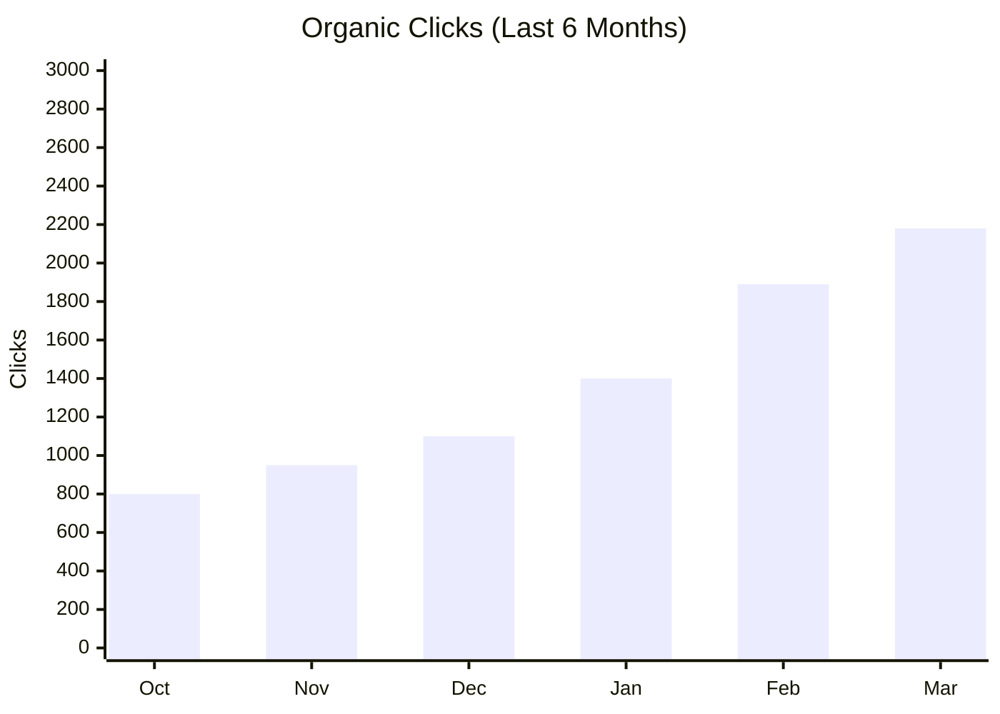
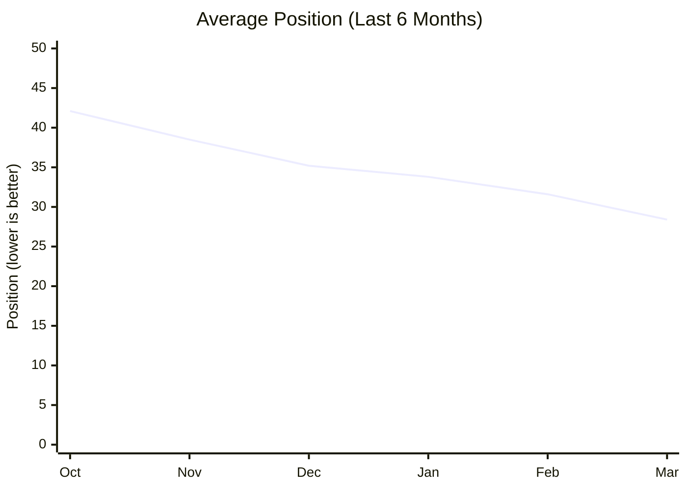

# SEO Performance Dashboard Template

**Report Period:** `[YYYY-MM-DD]` to `[YYYY-MM-DD]`
**Generated:** `[YYYY-MM-DD]`
**Data Sources:** Google Search Console, Google Analytics 4, Moz/Ahrefs (free tier)
**Related Issue:** [#473 - SEO Benchmark Initiative](https://github.com/clarkemoyer/technologyadoptionbarriers.org/issues/473)

---

## How to Use This Template

1. **Copy this file** and rename it with the reporting period (e.g., `seo-dashboard-2026-03.md`).
2. **Replace all `[placeholder]` values** with actual data from the data sources listed above.
3. **Update trend indicators** using the legend below.
4. **Automated option:** Run `scripts/collect-seo-keywords.ts` and `scripts/collect-page-seo-metrics.ts` via GitHub Actions to generate raw data, then populate this template from the JSON output in `reports/seo/`.
5. **Data file:** `src/data/seo-metrics.json` stores the latest metrics snapshot for programmatic use.

### Trend Indicator Legend

| Indicator | Meaning                                     |
| :-------- | :------------------------------------------ |
| 🟢 ▲      | Improved (positive change, higher = better) |
| 🔴 ▼      | Declined (negative change)                  |
| 🟡 ◆      | Stable (minimal or no change)               |

> **Note:** For position metrics, lower numbers are better (position 1 = top result). A decrease in position number is an improvement.

---

## 1. Key Performance Indicators (KPIs)

| KPI                   | Current Value | Previous Period |      Change |  Trend  |
| :-------------------- | ------------: | --------------: | ----------: | :-----: |
| Organic Sessions      |     `[value]` |       `[value]` |   `[±X.X%]` | `[🟢▲]` |
| Total Impressions     |     `[value]` |       `[value]` |   `[±X.X%]` | `[🟢▲]` |
| Total Clicks          |     `[value]` |       `[value]` |   `[±X.X%]` | `[🟢▲]` |
| Average CTR           |     `[X.XX%]` |       `[X.XX%]` | `[±X.X pp]` | `[🟢▲]` |
| Average Position      |       `[X.X]` |         `[X.X]` |    `[±X.X]` | `[🟢▲]` |
| Domain Authority (DA) |         `[X]` |           `[X]` |      `[±X]` | `[🟢▲]` |
| Indexed Pages         |         `[X]` |           `[X]` |      `[±X]` | `[🟡◆]` |
| Referring Domains     |         `[X]` |           `[X]` |      `[±X]` | `[🟢▲]` |

> **Data sources:** Organic Sessions from Google Analytics 4. Impressions, Clicks, Average CTR, and Average Position from Google Search Console. DA from Moz Link Explorer (free). Indexed Pages from Google Search Console Coverage report.

---

## 2. Keyword Rankings Summary

### Top Keywords by Organic Clicks

| Keyword       | Position | Prev. Position |  Trend  | Monthly Volume | Clicks | Impressions |      CTR |
| :------------ | -------: | -------------: | :-----: | -------------: | -----: | ----------: | -------: |
| `[keyword 1]` |    `[X]` |          `[X]` | `[🟢▲]` |          `[X]` |  `[X]` |       `[X]` | `[X.X%]` |
| `[keyword 2]` |    `[X]` |          `[X]` | `[🟢▲]` |          `[X]` |  `[X]` |       `[X]` | `[X.X%]` |
| `[keyword 3]` |    `[X]` |          `[X]` | `[🔴▼]` |          `[X]` |  `[X]` |       `[X]` | `[X.X%]` |
| `[keyword 4]` |    `[X]` |          `[X]` | `[🟡◆]` |          `[X]` |  `[X]` |       `[X]` | `[X.X%]` |
| `[keyword 5]` |    `[X]` |          `[X]` | `[🟢▲]` |          `[X]` |  `[X]` |       `[X]` | `[X.X%]` |

> **How to populate:** Run `scripts/collect-seo-keywords.ts` or export from Google Search Console > Performance > Queries.

### Keyword Distribution by Position Range

| Position Range | Keyword Count | Previous Count | Change |
| :------------- | ------------: | -------------: | -----: |
| 1–3 (Top 3)    |         `[X]` |          `[X]` | `[±X]` |
| 4–10 (Page 1)  |         `[X]` |          `[X]` | `[±X]` |
| 11–20 (Page 2) |         `[X]` |          `[X]` | `[±X]` |
| 21–50          |         `[X]` |          `[X]` | `[±X]` |
| 50+            |         `[X]` |          `[X]` | `[±X]` |

---

## 3. Page Performance (Top 20 by Organic Traffic)

|   # | Page          | Clicks | Impressions |      CTR | Avg Position | GA Sessions | Engagement Rate |
| --: | :------------ | -----: | ----------: | -------: | -----------: | ----------: | --------------: |
|   1 | `[/page-url]` |  `[X]` |       `[X]` | `[X.X%]` |      `[X.X]` |       `[X]` |        `[X.X%]` |
|   2 | `[/page-url]` |  `[X]` |       `[X]` | `[X.X%]` |      `[X.X]` |       `[X]` |        `[X.X%]` |
|   3 | `[/page-url]` |  `[X]` |       `[X]` | `[X.X%]` |      `[X.X]` |       `[X]` |        `[X.X%]` |
|   4 | `[/page-url]` |  `[X]` |       `[X]` | `[X.X%]` |      `[X.X]` |       `[X]` |        `[X.X%]` |
|   5 | `[/page-url]` |  `[X]` |       `[X]` | `[X.X%]` |      `[X.X]` |       `[X]` |        `[X.X%]` |

> **How to populate:** Run `scripts/collect-page-seo-metrics.ts` or combine Google Search Console (Pages tab) with GA4 (Pages and screens report). Only include pages with >10 impressions.

### Underperforming Pages (High Impressions, Low CTR)

| Page          | Impressions |      CTR | Avg Position | Issue                    | Action                       |
| :------------ | ----------: | -------: | -----------: | :----------------------- | :--------------------------- |
| `[/page-url]` |       `[X]` | `[X.X%]` |      `[X.X]` | `[e.g., weak title tag]` | `[e.g., rewrite title/meta]` |

---

## 4. Competitive Position Comparison

| Keyword       | TABS Position | Top Competitor | Competitor Position |   Gap | Opportunity      |
| :------------ | ------------: | :------------- | ------------------: | ----: | :--------------- |
| `[keyword 1]` |         `[X]` | `[Competitor]` |               `[X]` | `[X]` | `[High/Med/Low]` |
| `[keyword 2]` |         `[X]` | `[Competitor]` |               `[X]` | `[X]` | `[High/Med/Low]` |
| `[keyword 3]` |         `[X]` | `[Competitor]` |               `[X]` | `[X]` | `[High/Med/Low]` |

> **Reference:** See [Competitive SERP Benchmarking](./competitive-serp-benchmarking.md) and [Competitor Profiles](./competitor-profiles.md) for detailed competitor analysis.

### Domain Authority Comparison

| Site                                  | Domain Authority | Change | Referring Domains |
| :------------------------------------ | ---------------: | -----: | ----------------: |
| TABS (technologyadoptionbarriers.org) |            `[X]` | `[±X]` |             `[X]` |
| `[Competitor 1]`                      |            `[X]` | `[±X]` |             `[X]` |
| `[Competitor 2]`                      |            `[X]` | `[±X]` |             `[X]` |

---

## 5. Content Health Scorecard

| Metric                                         |       Score | Target | Status  |
| :--------------------------------------------- | ----------: | -----: | :-----: |
| Content Coverage (% of target topics covered)  |      `[X%]` |    80% | `[🟢▲]` |
| Content Freshness (% pages updated <90 days)   |      `[X%]` |    75% | `[🟡◆]` |
| Content Depth (avg word count vs. competitors) | `[X]` words |  2,000 | `[🔴▼]` |
| Technical SEO Score                            |      `[X%]` |    85% | `[🟡◆]` |
| Pages with Meta Descriptions                   |     `[X/Y]` |   100% | `[🟢▲]` |
| Pages with Structured Data                     |     `[X/Y]` |    60% | `[🔴▼]` |
| Pages with H1 Tags                             |     `[X/Y]` |   100% | `[🟢▲]` |

### Content Coverage by Topic Area

| Topic Area                                    | Pages |     Status     | Priority |
| :-------------------------------------------- | ----: | :------------: | :------- |
| Individual Adoption Models (TAM, UTAUT, etc.) | `[X]` | `[🟢 Covered]` | Maintain |
| Organizational Adoption Frameworks            | `[X]` | `[🟡 Partial]` | Expand   |
| Barrier Identification & Analysis             | `[X]` | `[🟢 Covered]` | Maintain |
| Executive & Leadership Content                | `[X]` |   `[🔴 Gap]`   | Create   |
| Survey Methodology & Results                  | `[X]` | `[🟢 Covered]` | Update   |
| Applied Research & Case Studies               | `[X]` |   `[🔴 Gap]`   | Create   |

---

## 6. Monthly Trend Summary

> **Note:** Mermaid diagrams render natively on GitHub. Replace sample values with actual monthly data points.

---

## Quick Actions

- [ ] Review underperforming pages and update titles/meta descriptions
- [ ] Check for new keyword opportunities from Search Console Discover
- [ ] Update content on pages that haven't been refreshed in >90 days
- [ ] Monitor competitor position changes for priority keywords
- [ ] Review and fix any technical SEO issues flagged by the content health scorecard

---

## Appendix: Data Collection Reference

| Data Point                                           | Source                | Collection Method                                                 |
| :--------------------------------------------------- | :-------------------- | :---------------------------------------------------------------- |
| Keyword rankings, clicks, impressions, CTR, position | Google Search Console | `scripts/collect-seo-keywords.ts` or GSC web UI                   |
| Page-level organic performance                       | Google Search Console | `scripts/collect-page-seo-metrics.ts` or GSC web UI               |
| Sessions, engagement rate, active users              | Google Analytics 4    | `scripts/collect-seo-keywords.ts` (GA4 integration) or GA4 web UI |
| Domain Authority                                     | Moz Link Explorer     | Manual check (free tier)                                          |
| Competitor rankings                                  | Manual SERP analysis  | Google Search (incognito mode)                                    |
| Content health metrics                               | Site audit            | Manual review or Lighthouse CI                                    |

> **Automated collection:** The GitHub Actions workflow (`.github/workflows/seo-metrics.yml`) runs `collect-seo-keywords.ts` and `collect-page-seo-metrics.ts` on a schedule. Output is saved to `reports/seo/` and summarized in workflow step summaries.
